# SOC Homelab — Detection Engineering, Segmentation & Purple-Team Validation

A security-focused homelab built to practice **network segmentation, SIEM engineering, endpoint telemetry, PKI, vulnerability management, Active Directory, and purple-team validation** in an environment that behaves more like a small enterprise than a collection of isolated VMs.

The lab uses a bare-metal OPNsense firewall, a Cisco 3560CX switch, a two-node Proxmox cluster, Elastic Stack, Suricata, HashiCorp Vault, Greenbone/OpenVAS, Windows Active Directory, and a Kali Linux red-team host. The project is intentionally documented around **security controls and evidence** rather than basic VM installation steps.

> **Portfolio focus:** defensive engineering, telemetry pipelines, firewall policy design, detection validation, alert tuning, PKI, and vulnerability management.

---

## Table of Contents

- [Architecture](#architecture)
- [Security Objectives](#security-objectives)
- [Network Segmentation](#network-segmentation)
- [OPNsense Firewall & IDS](#opnsense-firewall--ids)
- [Elastic SIEM & Telemetry Pipeline](#elastic-siem--telemetry-pipeline)
- [Detection Engineering & Validation](#detection-engineering--validation)
- [Configuration Artifacts](#configuration-artifacts)
- [Active Directory Lab](#active-directory-lab)
- [HashiCorp Vault PKI](#hashicorp-vault-pki)
- [Vulnerability Management](#vulnerability-management)
- [Proxmox & Switching](#proxmox--switching)
- [Key Engineering Decisions](#key-engineering-decisions)
- [Lessons Learned](#lessons-learned)
- [Technology Stack](#technology-stack)

---

## Architecture

### Core Infrastructure

| System | Role | Address / Network |
|---|---|---|
| OPNsense | Bare-metal firewall/router, DHCP relay, Suricata, Filebeat | `192.168.1.1`, `192.168.99.1` |
| Cisco 3560CX | Managed access/trunk switch | `192.168.99.3` |
| pve1 | Proxmox hypervisor | `192.168.99.2` |
| pve2 | Proxmox hypervisor | `192.168.99.50` |
| ELK | Elasticsearch, Logstash, Kibana, Fleet | `192.168.40.10` |
| OpenVAS | Greenbone vulnerability scanner | `192.168.40.20` |
| HashiCorp Vault | Internal PKI / certificate authority | `192.168.40.30` |
| DC01 | Windows Server 2025 AD DS / DNS | `192.168.60.10` |
| ZMH-WS1 | Windows 11 domain workstation | `192.168.50.171` |
| Kali | Red-team / validation host | `192.168.70.10` |

### Traffic & Telemetry Flow

```text
Internet / ONT
      |
      v
  OPNsense
      |
      +---------------------------+
      | VLAN routing + policy     |
      | Suricata IDS              |
      | Filebeat telemetry        |
      +---------------------------+
      |
      v
Cisco 3560CX
      |
      +--> VLAN 10  Main/Admin
      +--> VLAN 20  WiFi
      +--> VLAN 30  Wired Desktop
      +--> VLAN 40  Security Services
      +--> VLAN 50  Windows Workstation
      +--> VLAN 60  Domain Controller
      +--> VLAN 70  Red Team
      +--> VLAN 99  Management

OPNsense Filebeat --TLS/5044--> Logstash --verified TLS--> Elasticsearch --> Kibana
Windows Elastic Agent -------------------------------> Fleet / Elasticsearch
Suricata ---------------------> custom alert/log indices --> Elastic Security
```

---

## Security Objectives

The lab was designed around the following controls and workflows:

- **Least-privilege inter-VLAN routing** with explicit service exceptions and default-deny behavior.
- **Centralized security telemetry** from firewall, IDS, Linux, and Windows endpoints.
- **Centralized endpoint security deployment** using Active Directory Group Policy to deploy Sysmon and Elastic Agent/Elastic Defend to scoped Windows systems.
- **Detection validation** by generating controlled traffic from Kali and confirming corresponding Suricata/Elastic evidence.
- **Detection tuning** by investigating noisy signatures and separating true scan behavior from false positives.
- **Internal PKI** with a root/intermediate hierarchy managed through HashiCorp Vault.
- **Vulnerability management** using Greenbone/OpenVAS against internal systems.
- **Active Directory visibility** through Windows event collection and domain-service validation.
- **Management-plane isolation** by separating hypervisor/switch administration from user and red-team networks.

---

## Network Segmentation

| VLAN | Subnet | Purpose | Security Posture |
|---|---|---|---|
| 10 | `192.168.10.0/24` | Main / Admin | Trusted administration network |
| 20 | `192.168.20.0/24` | WiFi | Internet-oriented; blocked from routed internal networks |
| 30 | `192.168.30.0/24` | Wired desktop | Limited / Internet-oriented |
| 40 | `192.168.40.0/24` | Security services | ELK, OpenVAS, Vault |
| 50 | `192.168.50.0/24` | Windows workstation | Domain member; AD and Elastic exceptions only |
| 60 | `192.168.60.0/24` | Domain Controller | Restricted server segment |
| 70 | `192.168.70.0/24` | Red Team | Kali testing segment with explicit target exceptions |
| 99 | `192.168.99.0/24` | Management | Proxmox, switch, firewall management |

### Protected Networks Alias

OPNsense uses a `Protected_Networks` alias containing all internal routed VLAN subnets. Segments that should not freely traverse the environment receive a logged block rule to this alias, with only necessary service-specific exceptions placed above it.

This makes the policy easier to maintain than duplicating individual inter-VLAN deny rules and provides cleaner telemetry when a host attempts to cross a trust boundary.


*OPNsense VLAN configuration for the segmented lab networks.*


*Routed interfaces used to enforce policy between security zones.*

---

## OPNsense Firewall & IDS

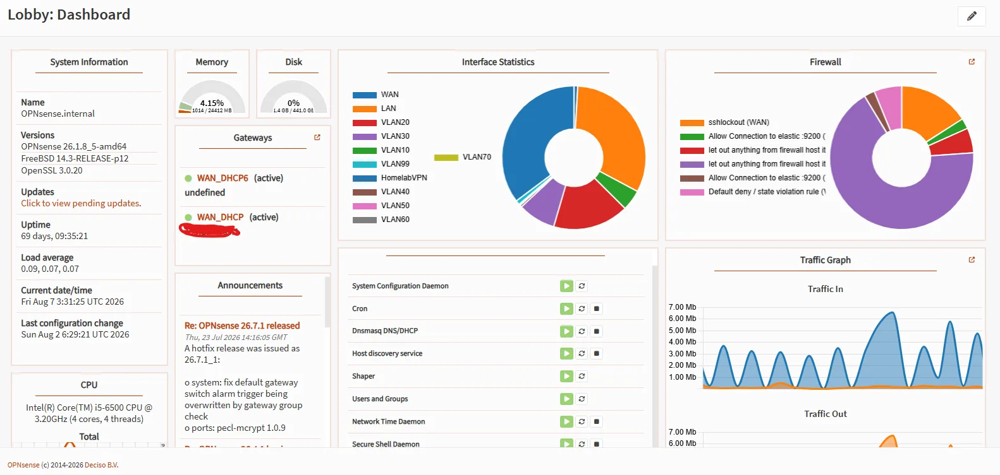

*OPNsense provides the central routing, firewall policy, IDS, and telemetry-export functions for the lab.*

### Firewall Policy

The final rulesets follow a consistent pattern:

1. **Specific required service exceptions**
2. **Block to `Protected_Networks`**
3. **Limited Internet services where required**
4. **Logged default deny**

Routine successful traffic is not logged unless useful for a specific security workflow; meaningful deny rules are logged for analysis in Elastic.

### VLAN 40 — Security Services

The security segment contains ELK, OpenVAS, and Vault. OpenVAS receives explicit exceptions to scan the intended Windows networks, while other security-service traffic is prevented from freely reaching protected internal segments.

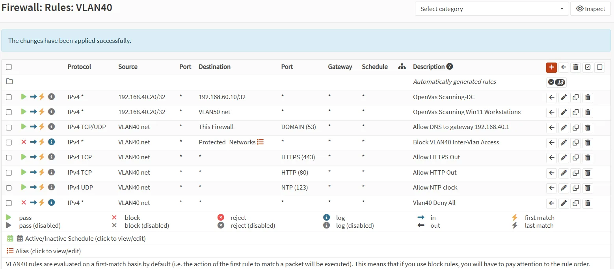

**Rule rationale:** Security tooling is not treated as implicitly trusted just because it resides in the security VLAN. OpenVAS receives narrowly scoped access to authorized scan targets, while ELK, Vault, and other services rely on service-specific flows rather than unrestricted east-west access. Broader traffic to `Protected_Networks` is denied, limiting the ability of a compromised security appliance to become a pivot into the rest of the lab.

### VLAN 50 — Windows Workstation

The Windows workstation segment is restricted to the services needed for Active Directory and Elastic Agent communication. AD-specific traffic is directed to DC01, while direct cross-VLAN access is denied unless explicitly allowed.

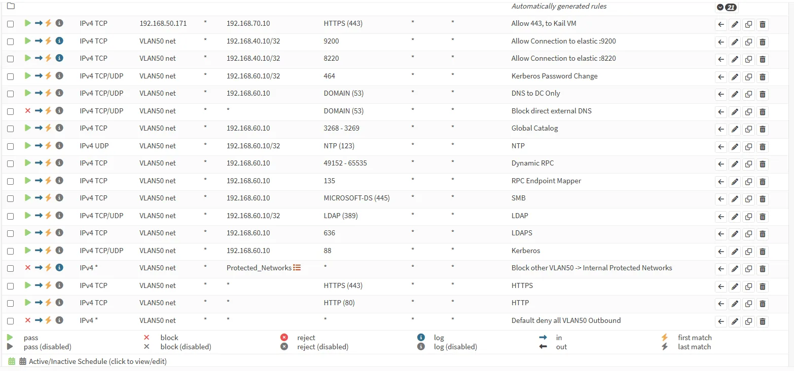

**Rule rationale:** ZMH-WS1 needs domain services and telemetry connectivity without being given broad access to other internal networks. Required AD/DNS communication to DC01 and Elastic Agent traffic are allowed explicitly above the broader deny rules. Other routed internal access falls through to the `Protected_Networks` block, reducing unnecessary east-west reachability from a user workstation.

### VLAN 60 — Domain Controller

DC01 is permitted to reach required Elastic services and the OPNsense DNS/DHCP path while remaining blocked from arbitrary access to other internal networks.

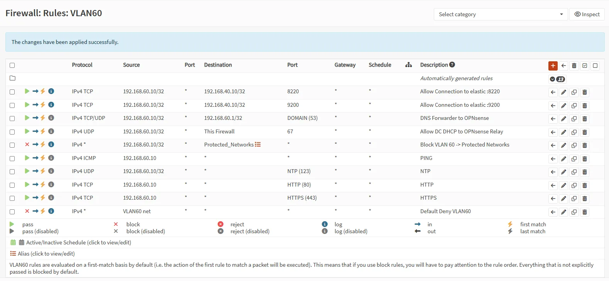

**Rule rationale:** DC01 is treated as a high-value server segment rather than as a generally trusted source. Only the infrastructure and telemetry paths required for normal operation are permitted, including the OPNsense DNS/DHCP path and Elastic services. Unnecessary access to other protected networks remains denied, reducing the lateral-movement options available if the domain-controller segment were ever compromised.

### VLAN 70 — Red Team

Kali is intentionally isolated. The segment can reach explicitly approved lab targets for testing, but broad access to protected networks is denied and logged.

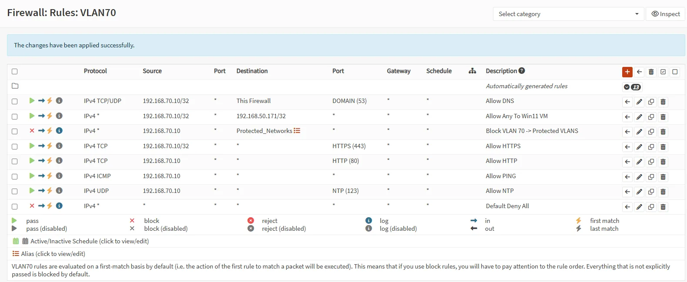

**Rule rationale:** Kali is deliberately treated as untrusted. Test-specific exceptions are placed above the broad internal deny so approved workflows—such as scoped RDP validation against ZMH-WS1 and controlled detection tests—can occur without granting VLAN 70 general access to internal systems. Traffic outside those exceptions is denied and logged, making the firewall both a preventive control and a source of validation telemetry in Elastic.

### VLAN 99 — Management

Management traffic is kept separate from normal user workloads. The VLAN is used for Proxmox, switch, and firewall administration and follows the same explicit-service/default-deny model.

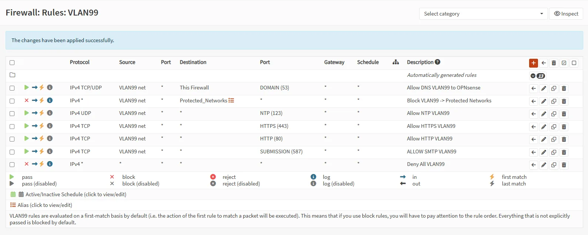

**Rule rationale:** VLAN 99 is the infrastructure management plane, so access is separated from normal workstation and service traffic. Required administration and infrastructure flows are permitted explicitly before the broader protected-network and default-deny rules. Unexpected management-plane egress is logged; this policy previously exposed direct SMTP attempts from a Proxmox host, demonstrating how restrictive management rules can also reveal unintended application behavior.

### Suricata IDS

Suricata runs on OPNsense in IDS mode and provides network-level alerting that is forwarded into Elastic for correlation, dashboards, and Security detection rules.

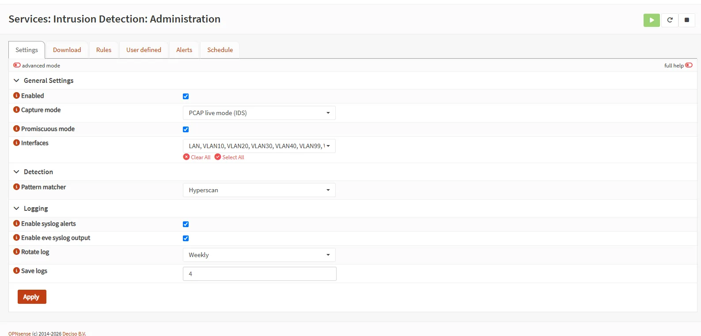

*Intrusion detection configuration on OPNsense.*

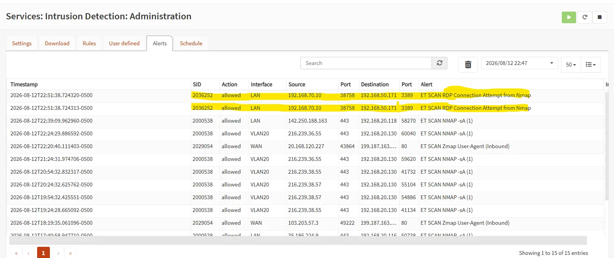

*Live Suricata alert evidence generated by lab traffic.*

### Filebeat Export

OPNsense Filebeat forwards firewall and Suricata telemetry to Logstash over TLS.

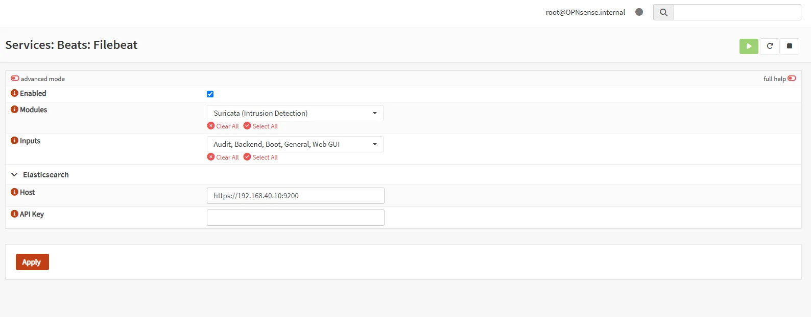

---

## Elastic SIEM & Telemetry Pipeline

### Pipeline

```text
OPNsense (Filebeat)
    |
    | TLS :5044
    v
Logstash
    |-- Suricata alerts  --> suricata-alerts-ecs-*
    |-- Suricata logs    --> suricata-logs-*
    |-- Firewall logs    --> firewall-logs-*
    |-- DNS logs         --> dns-logs-*
    |-- DHCP logs        --> dhcp-logs-*
    |-- OPNsense auth    --> opnsense-auth-*
    |
    | verified TLS / internal CA
    v
Elasticsearch
    |
    v
Kibana / Elastic Security

Elastic Agent / Fleet
    |-- Elastic Defend endpoint telemetry
    |-- Windows Security/System/Application logs
    |-- Sysmon telemetry
    |-- Linux system/auth logs
    v
Elasticsearch
```

### Fleet

Fleet centrally manages the Elastic Agents used by the lab systems.

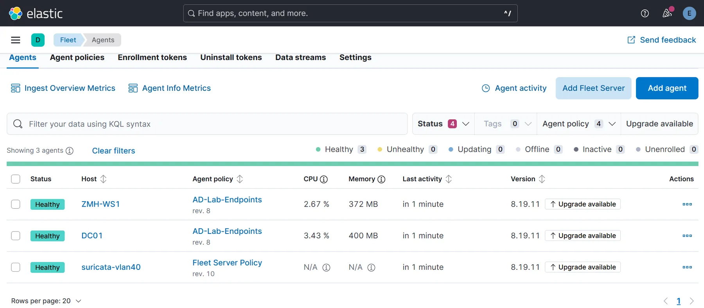

### Endpoint Telemetry — Elastic Defend & Sysmon

Windows endpoint coverage combines Elastic Defend with Sysmon rather than relying on a single telemetry source. Elastic Agent is centrally managed through Fleet and carries the Elastic Defend integration for endpoint security visibility, while Sysmon provides additional high-fidelity Windows host telemetry useful for investigation and detection engineering.

Deployment is automated through Active Directory Group Policy. Separate GPOs deploy the Elastic Agent/Elastic Defend stack and Sysmon to scoped domain systems, making endpoint instrumentation repeatable and reducing manual configuration drift. This ties the AD environment directly into the defensive architecture: domain policy is used not only for identity and workstation management, but also to establish consistent security visibility.

### Data Views

Separate Kibana data views make firewall, Suricata, and endpoint telemetry easier to query without losing the underlying index separation. A dedicated Suricata ECS data view targets `suricata-alerts-ecs-*` so detection rules do not mix the current ECS mappings with legacy Suricata alert indices.

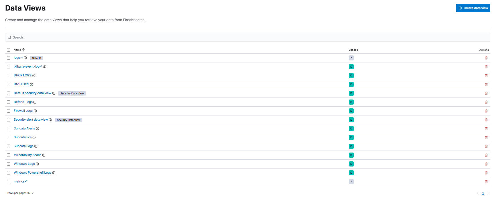

*Current Kibana data views, including the dedicated Suricata ECS view used by Elastic Security detections.*

### Suricata ECS Normalization

The original custom Suricata indices dynamically mapped `source.ip` and `destination.ip` as text/keyword fields. That prevented reliable CIDR matching in Elastic Security and created field-type conflicts across historical indices.

A dedicated `suricata-alerts-ecs-*` index pattern and template now map the core fields using ECS-compatible types:

```text
source.ip        -> ip
destination.ip   -> ip
source.port      -> long
destination.port -> long
```

Logstash also adds security-event context to Suricata alerts:

```text
event.kind     = alert
event.category = intrusion_detection
event.type     = allowed
```

This allows Security rules to query internal address ranges natively while keeping the older indices intact as historical data.

### Security Overview Dashboard

A custom Kibana dashboard summarizes the most useful defensive signals: Suricata alerts, internal firewall blocks, Windows failed logons, alert trends, blocked destination ports, and top Suricata signatures.

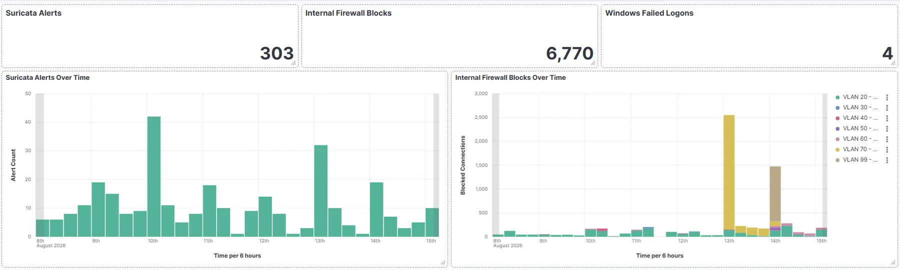

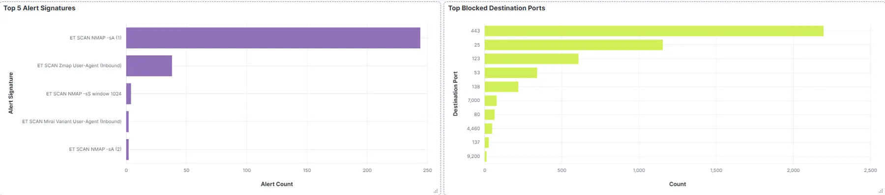

The dashboard is intended to answer three questions quickly:

- **What is being blocked?**
- **What is Suricata detecting?**
- **Are endpoint authentication events showing suspicious activity?**

### Firewall Evidence in Discover

A controlled Kali-to-security-network connection attempt is visible in Kibana with the source, destination, interface, and block action preserved.

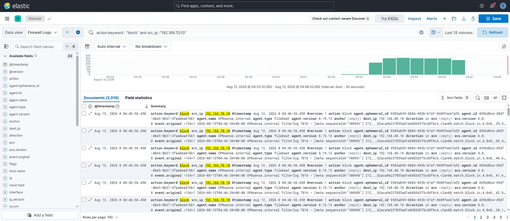

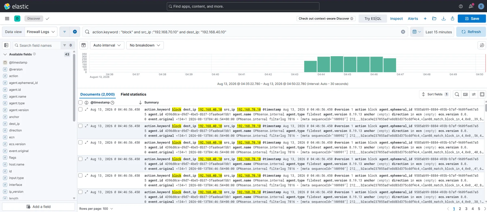

### Windows Failed Logons

Windows Security Event ID `4625` is collected from the domain workstation and can be queried directly in Kibana.

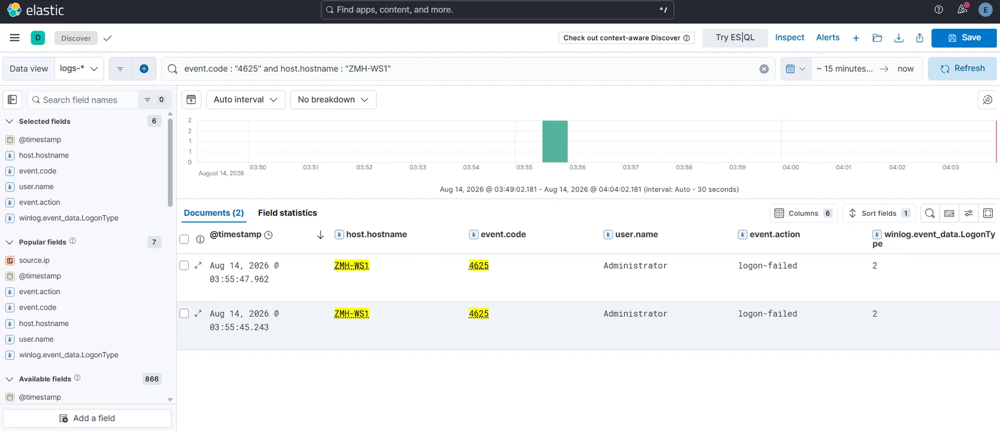

This validates the endpoint portion of the pipeline independently of network IDS data.

---

## Detection Engineering & Validation

The lab is used as a closed-loop validation environment:

```text
Generate known activity -> Observe network/endpoint telemetry -> Query in Elastic
-> Confirm detection -> Tune noise -> Repeat
```

### Nmap Validation

Controlled Nmap activity from Kali is used to validate that scan telemetry reaches Suricata, the ECS-normalized alert index, and Elastic Security.

A validated ACK-scan test generated the following chain:

```text
Kali 192.168.70.10
    -> Nmap ACK scan
    -> Suricata ET SCAN NMAP -sA (1), SID 2000538
    -> Logstash ECS normalization
    -> suricata-alerts-ecs-*
    -> Elastic Security detection
```

The Security rule is scoped to internal-to-internal traffic, allowing native CIDR matching after the ECS migration:

```kql
suricata.eve.alert.signature : "ET SCAN NMAP -sA (1)" AND
source.ip : "192.168.0.0/16" AND
destination.ip : "192.168.0.0/16"
```

This preserves visibility across all internal VLANs while excluding public Internet return traffic that previously triggered the same legacy signature.


### Linux SSH Password-Guessing Detection

Linux authentication logs are collected through Elastic Agent and evaluated by an Elastic Security EQL correlation rule. The rule detects three failed password-based SSH logins from the same source to the same host within 60 seconds.

The validated events contain structured fields such as:

```text
event.action            = ssh_login
event.outcome           = failure
system.auth.ssh.method  = password
system.auth.ssh.event   = Failed
```

The detection is mapped to **MITRE ATT&CK T1110.001 — Password Guessing**, while the Nmap detection maps to **T1046 — Network Service Scanning**.

### Elastic Security Alerts

The Security alert queue shows both validated detections operating together: the internal Nmap ACK-scan rule and the Linux SSH password-guessing correlation rule.

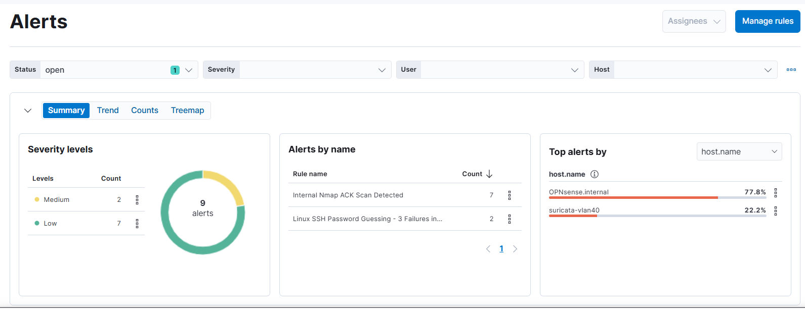

*Elastic Security alert summary showing validated network and authentication detections.*

### Detection Tuning Example

During dashboard review, the signature `ET SCAN NMAP -sA (1)` was disproportionately noisy. Investigation showed many events with public HTTPS servers as the source, source port `443`, internal WiFi clients as destinations, and high ephemeral destination ports.

That pattern was consistent with **return HTTPS traffic being misclassified by the legacy signature**, not actual internal Nmap ACK scanning. Rather than treating every signature hit as equivalent, the Elastic Security rule was constrained to internal source and destination ranges. The tuned detection keeps useful internal scan coverage without promoting unrelated Internet return traffic into SOC alerts.

### Runtime Field for Blocked Destination Ports

OPNsense `filterlog` data delivered through the custom Logstash pipeline preserved destination ports inside the raw `rest` field instead of mapping them into an ECS destination-port field. A Kibana runtime field was created to extract TCP/UDP destination ports so the dashboard could visualize the most commonly blocked services without requiring an immediate pipeline migration.

This enabled useful investigations such as identifying:

- blocked SMTP/25 traffic from a Proxmox host,
- NTS key-establishment traffic on TCP/4460 from Vault,
- blocked red-team testing traffic,
- expected NetBIOS and DNS chatter crossing restricted boundaries.

---

## Configuration Artifacts

Sanitized reference copies of the active security configuration are published under [`configs/`](configs/README.md). Secrets, private keys, service tokens, Vault material, and passwords are intentionally excluded.

| Artifact | Demonstrates |
|---|---|
| [`filebeat-opnsense.yml`](configs/sanitized/filebeat-opnsense.yml) | OPNsense log collection and TLS forwarding to Logstash |
| [`logstash-opnsense.conf`](configs/sanitized/logstash-opnsense.conf) | Log routing, Suricata ECS normalization, GeoIP enrichment, verified Elasticsearch TLS, and custom indices |
| [`elasticsearch.yml`](configs/sanitized/elasticsearch.yml) | Elasticsearch TLS/security configuration and HTTP certificate-chain deployment |
| [`kibana.yml`](configs/sanitized/kibana.yml) | Kibana HTTPS, Elasticsearch trust, and Fleet output configuration |
| [`suricata-local.rules`](configs/sanitized/suricata-local.rules) | Custom internal scan detection rule |
| [`suricata-alerts-ecs-template.json`](configs/sanitized/suricata-alerts-ecs-template.json) | Native ECS field mappings for Suricata Security alerts |

Logstash validates the Elasticsearch certificate chain and server identity against the internal root CA using full TLS verification.

---

## Active Directory Lab

The Windows environment uses the `zmh.homelab` domain with Windows Server 2025 as DC01 and a Windows 11 domain workstation.

### Domain Controller

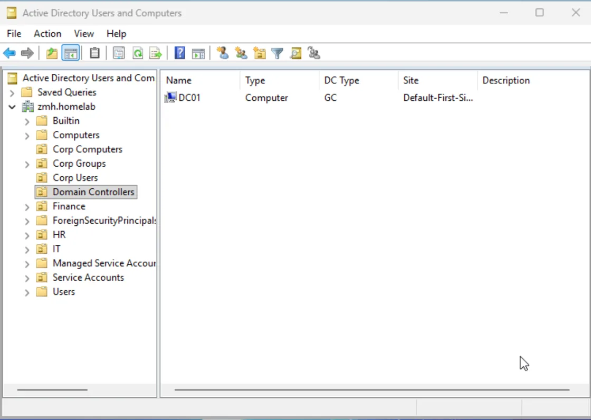

### Domain Workstation

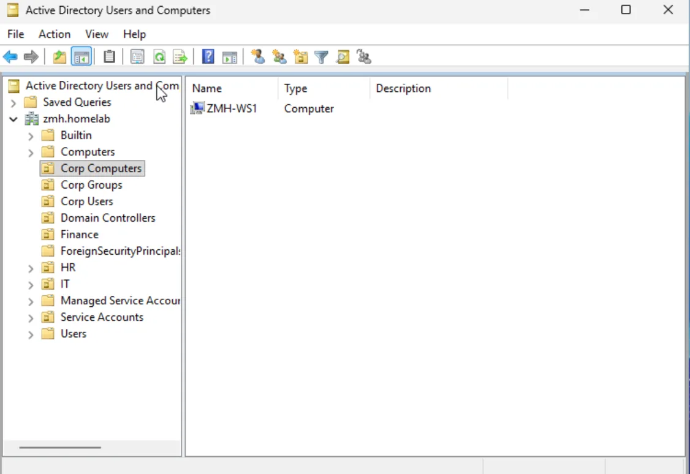

### Group Policy Security Deployment

Active Directory also serves as a centralized endpoint-security deployment mechanism. Separate Group Policy Objects are used to deploy Sysmon and Elastic Agent/Elastic Defend to scoped Windows systems, standardizing endpoint instrumentation instead of relying on one-off manual installs. The resulting endpoint telemetry feeds the same Elastic environment used for network, authentication, and detection-engineering workflows.

### Kali-to-Workstation Validation and Domain Discovery

The Kali red-team host was used to validate the explicitly permitted path to ZMH-WS1 before beginning domain discovery. An Nmap check confirmed that RDP/TCP 3389 was reachable on the workstation, after which a FreeRDP session was initiated from the isolated red-team VLAN.

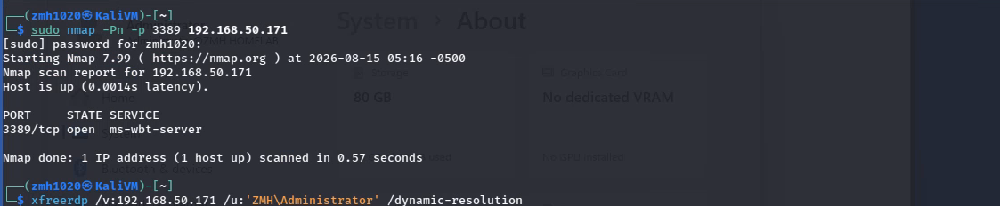

*Connectivity validation to ZMH-WS1 followed by the FreeRDP command used to initiate the authorized workstation session.*

The completed FreeRDP connection verified that the scoped firewall exception allowed access to the intended workstation without granting broad access from the red-team segment.

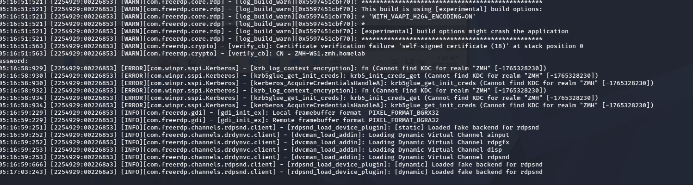

*Successful end state of the Kali-to-ZMH-WS1 RDP session.*

From the workstation session, `nltest` and DNS SRV lookups were then used to validate Active Directory service discovery. The results confirmed:

- workstation domain identity,
- discovery of `DC01.zmh.homelab`,
- DC address `192.168.60.10`,
- LDAP/Kerberos/GC/DNS roles,
- `_ldap._tcp.dc._msdcs.zmh.homelab` service discovery.

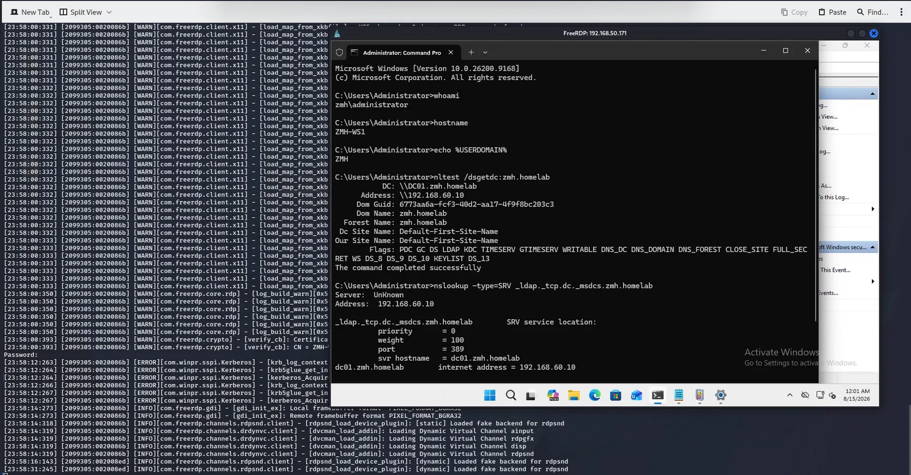

*Domain discovery performed from ZMH-WS1 after the Kali-originated RDP session was established.*

Together, these screenshots show the complete validation path: **network reachability → scoped remote access → successful session → domain discovery**. This provides both administrative validation and purple-team telemetry generation from the same controlled workflow.

---

## HashiCorp Vault PKI

Vault provides an internal certificate authority rather than relying on self-signed leaf certificates for every service.

### CA Hierarchy

```text
Homelab-Root-CA          RSA-4096 / 10 years
    |
    +-- Homelab-Intermediate-CA   RSA-4096 / 5 years
            |
            +-- Service leaf certificates   1 year
```

The root and intermediate CAs are separated into distinct Vault PKI mounts, with service certificates issued through an intermediate role.

### Root CA

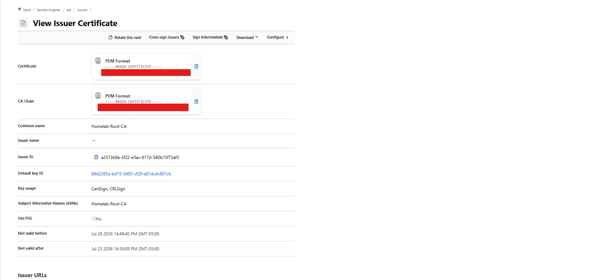

### Intermediate CA

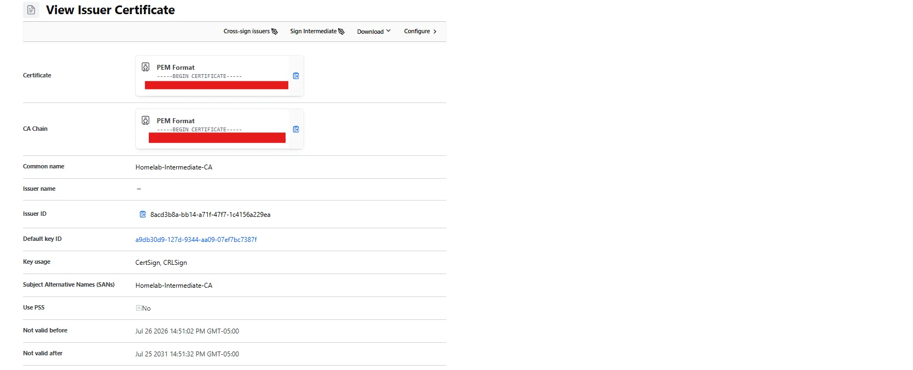

### Issued Service Certificates

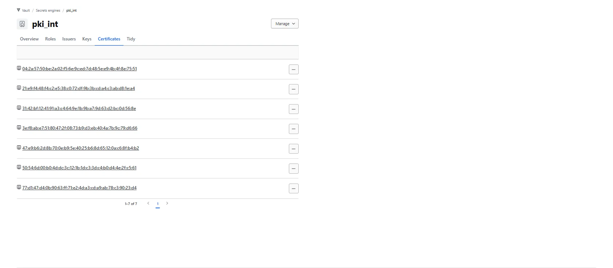

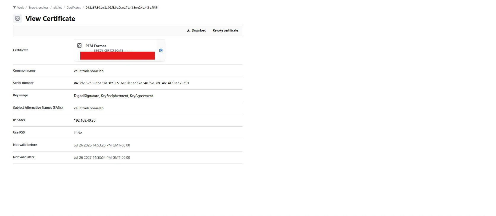

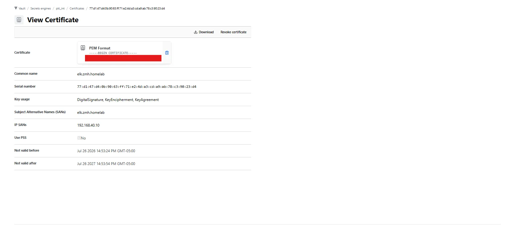

### Browser Trust Validation

The Vault-issued Kibana certificate chains successfully through the internal intermediate and root CA in the workstation trust store.

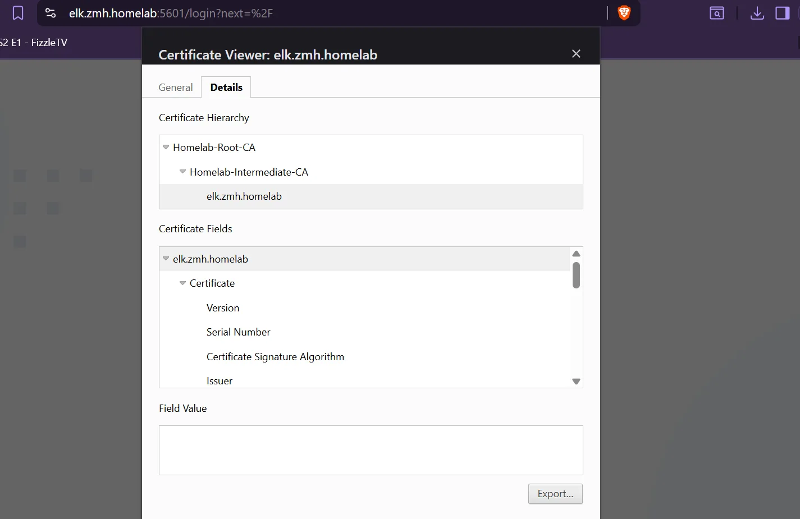

This PKI is used to secure internal services including Elastic/Kibana, Logstash ingestion, OPNsense management, Proxmox, and OpenVAS.

> Private keys, Vault unseal shares, root tokens, service tokens, and passwords are intentionally excluded from this repository.

---

## Vulnerability Management

Greenbone/OpenVAS is deployed in the security-services VLAN and is allowed to scan only explicitly authorized internal targets through OPNsense exceptions.

### ELK Scan Report

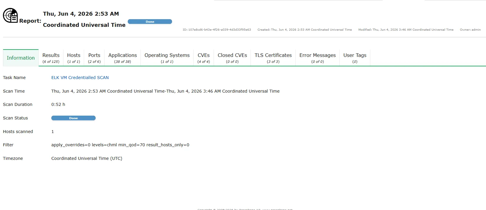

### Findings

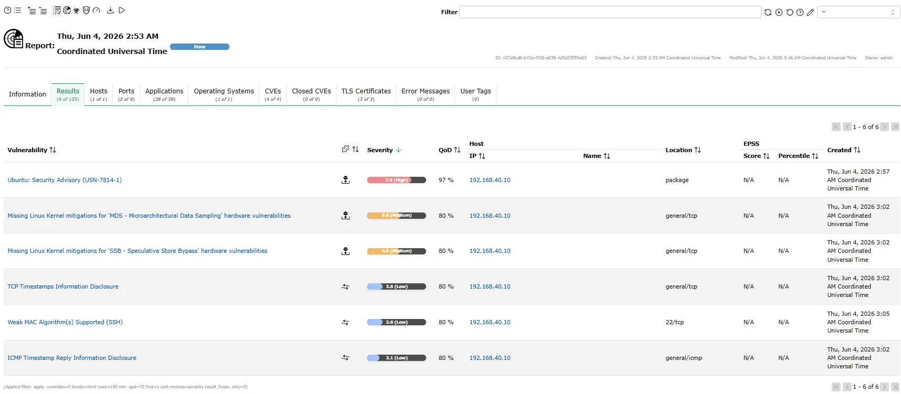

The scanner is intentionally separated from the targets it assesses. Firewall rules permit the scanner's required paths rather than giving the entire security VLAN unrestricted access to internal networks.

---

## Proxmox & Switching

### Proxmox Cluster

The environment runs across two Proxmox nodes. VLAN-aware bridges carry tagged VM networks while VLAN 99 remains dedicated to infrastructure management.

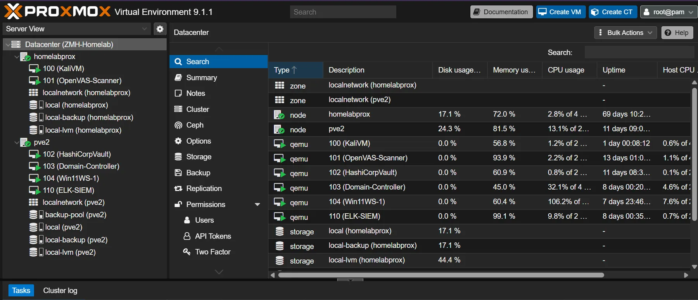

### Cisco 3560CX

The Cisco switch provides the physical VLAN trunks and access-port assignments between OPNsense, the Proxmox hosts, and endpoint networks.

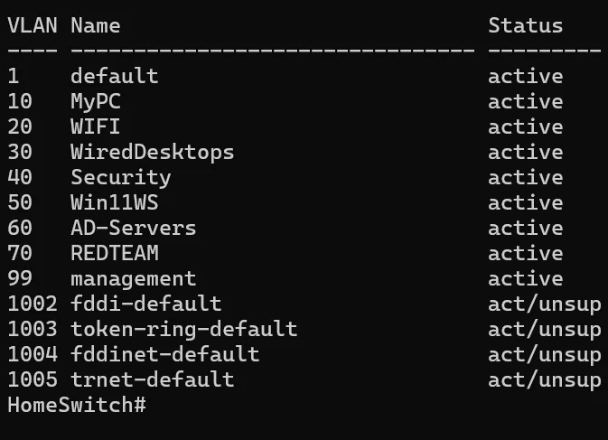

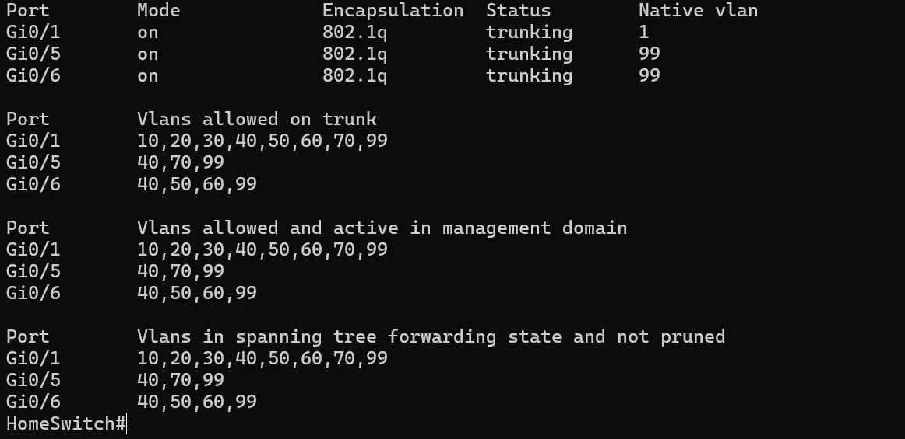

This keeps Layer 2 segmentation explicit and allows OPNsense to remain the Layer 3 policy enforcement point for routed VLAN traffic.

---

## Key Engineering Decisions

### 1. Default-Deny Between Trust Zones

Rather than using a flat network with broad `allow any` policies, the lab treats each VLAN as a different security zone. Required flows are documented and explicitly permitted.

### 2. Admin Access Originates from a Trusted Segment

Administrative RDP/SSH sessions originate from VLAN 10. Because OPNsense rules are evaluated on the ingress interface and connections are stateful, restrictive egress policies on server VLANs do not require redundant response rules.

### 3. Red-Team Traffic Is Constrained

Kali is not placed on a trusted network. Testing exceptions are scoped to intended targets so offensive validation does not weaken the architecture being tested.

### 4. Security Telemetry Uses Verified TLS

OPNsense-to-Logstash ingestion uses TLS, and Logstash-to-Elasticsearch connections validate the internal PKI chain and server identity with full certificate verification.

### 5. Alert Volume Is Treated as an Investigation Problem

Dashboard spikes are investigated by source/destination, interface, port, protocol, and direction. This approach exposed both benign infrastructure issues and IDS false positives without simply suppressing broad categories of alerts.

### 6. Detection Data Uses Purpose-Built ECS Mappings

The Suricata Security alert path uses a dedicated ECS template rather than relying on dynamic mappings. This keeps IP fields queryable as IPs, supports CIDR logic, and separates current detection data from legacy indices with incompatible field types.

---

## Lessons Learned

### Firewall telemetry can expose configuration problems

After hardening VLAN 99, Elastic showed repeated TCP/25 blocks from a Proxmox host. Investigation traced them to the local Postfix/sendmail notification path attempting direct SMTP delivery while a separate authenticated SMTP notification target was already configured. The firewall was doing exactly what it should: denying direct outbound SMTP while providing evidence of the unexpected application behavior.

### Not every unusual port is malicious

TCP/4460 blocks from the Vault server initially looked suspicious. Investigation identified them as Network Time Security key-establishment traffic associated with secure time synchronization. A narrow source-specific exception was preferable to a broad allow rule.

### IDS rules require context

A high-count Nmap signature turned out to be a false-positive pattern on HTTPS return traffic. Looking at traffic direction and ephemeral ports prevented an incorrect conclusion and led to an internal-only Security detection rather than a broad noisy alert.

### Segmentation and detection reinforce each other

The firewall does more than prevent traffic: its deny events create high-value telemetry that can be correlated with Suricata and endpoint events. A blocked Kali connection therefore becomes both a preventive control and a detection-validation artifact.

### Certificate chains are part of telemetry reliability

Elastic Agent components stopped publishing when the configured CA fingerprint could not be validated against the certificate chain presented by Elasticsearch. Troubleshooting Filebeat queue backpressure and Agent TLS errors led to rebuilding the Elasticsearch HTTP certificate as a leaf-plus-intermediate chain and correcting Fleet trust to the issuing CA. This restored ingestion and reinforced that PKI failures can become monitoring failures.

### Infrastructure failures are part of security engineering

A failed pve2 NVMe drive required a Proxmox reinstall and VM rebuild. Rebuilding Vault, restoring certificates, re-enrolling Elastic components, and validating trust relationships reinforced the value of documented configuration, backups, and reproducible service dependencies.

---

## Technology Stack

| Area | Technologies |
|---|---|
| Firewall / Routing | OPNsense, pf, VLANs, NAT, DHCP relay, Unbound |
| Switching | Cisco Catalyst 3560CX, 802.1Q trunks |
| IDS / Network Security | Suricata, Emerging Threats rules |
| SIEM / Search | Elasticsearch, Logstash, Kibana, Elastic Security |
| Endpoint / Agent Management | Elastic Agent, Elastic Defend, Sysmon, Fleet, Windows Event Logs, Group Policy |
| Identity | Windows Server 2025, Active Directory, Group Policy, DNS, Kerberos, LDAP |
| PKI | HashiCorp Vault, X.509, internal root/intermediate CA |
| Vulnerability Management | Greenbone / OpenVAS |
| Virtualization | Proxmox VE cluster |
| Offensive Validation | Kali Linux, Nmap, FreeRDP |
| Operating Systems | Windows 11, Windows Server, Ubuntu Linux, Kali Linux, FreeBSD-based OPNsense |

---

## Project Status

The lab is operational and continues to evolve. Current work emphasizes **detection quality, telemetry enrichment, segmentation validation, and purple-team exercises** rather than adding services for their own sake.

Future improvements may include additional endpoint detections, expanded ECS normalization for firewall/DNS/DHCP data, automated certificate renewal, expanded vulnerability-management workflows, and additional ATT&CK-mapped detection documentation.

---

## About This Project

This project was built as hands-on preparation for **SOC Analyst, Security Analyst, and Detection Engineering** work. It is intentionally designed to demonstrate not only that security tools were installed, but that they were **integrated, constrained, tested, observed, and tuned** as part of a coherent defensive architecture.
