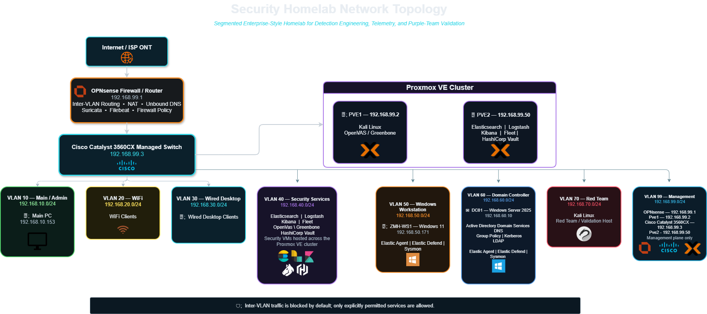
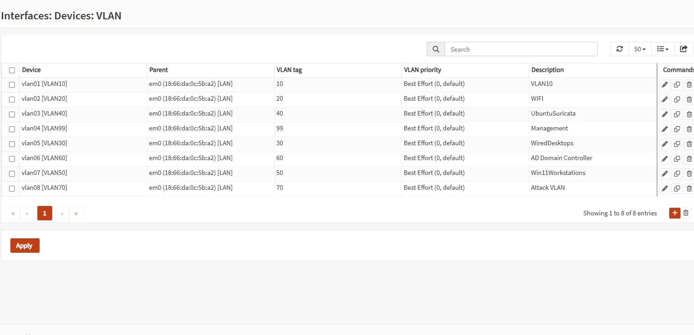
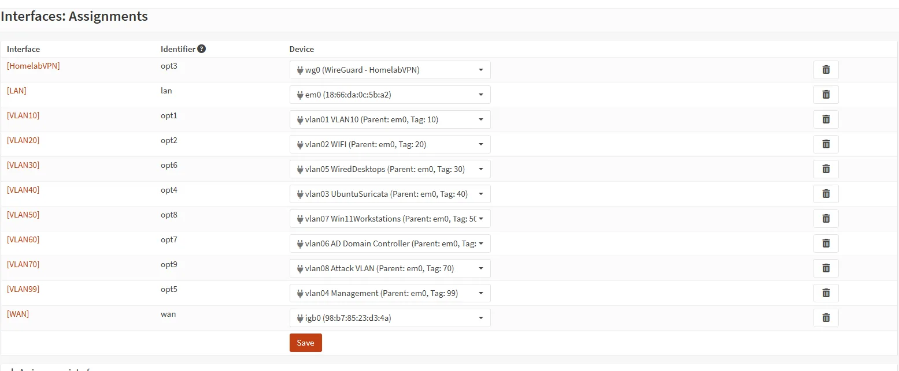

# Architecture & Trust Boundaries

[← Back to main README](../README.MD) · [Documentation index](README.md)

The lab is designed around **separate trust zones, centralized Layer 3 policy enforcement, and centralized telemetry**. Services are not considered trusted simply because they are internal; each VLAN has a defined purpose and explicit communication requirements.

## Network Topology



*The topology separates physical infrastructure, Proxmox host placement, logical VLAN membership, management interfaces, Active Directory, endpoint systems, and security-service workloads while keeping the inter-VLAN security boundary centered on OPNsense.*


## Core Infrastructure

| System | Role | Address / Network |
|---|---|---|
| OPNsense | Bare-metal firewall/router, DHCP relay, Suricata, Filebeat | `192.168.1.1`, `192.168.99.1` |
| Cisco 3560CX | Managed access/trunk switch | `192.168.99.3` |
| pve1 | Proxmox hypervisor | `192.168.99.2` |
| pve2 | Proxmox hypervisor | `192.168.99.50` |
| ELK | Elasticsearch, Logstash, Kibana, Fleet | `192.168.40.10` |
| OpenVAS | Greenbone vulnerability scanner | `192.168.40.20` |
| HashiCorp Vault | Internal PKI / certificate authority | `192.168.40.30` |
| DC01 | Windows Server 2025 AD DS / DNS | `192.168.60.10` |
| ZMH-WS1 | Windows 11 domain workstation | `192.168.50.171` |
| Kali | Red-team / validation host | `192.168.70.10` |

## Physical and Logical Flow

Internet connectivity terminates at the bare-metal **OPNsense firewall/router**, which remains the Layer 3 policy-enforcement point for routed VLAN traffic. The **Cisco Catalyst 3560CX** provides Layer 2 VLAN trunks and access-port assignments, while VLAN-aware Proxmox bridges place virtual machines into their intended security zones.

The topology deliberately shows the same virtual workloads from two perspectives: the **Proxmox VE Cluster** identifies hypervisor placement, while the VLAN cards identify logical network placement. Management interfaces remain on VLAN 99 even when the workloads hosted by those hypervisors reside on other VLANs.



*Logical VLAN definitions used to separate user, server, security, attacker, and management workloads.*



*Routed interfaces used as policy boundaries between security zones.*

## VLAN Model

| VLAN | Subnet | Purpose | Trust / Security Posture |
|---|---|---|---|
| 10 | `192.168.10.0/24` | Main / Admin | Trusted administration origin |
| 20 | `192.168.20.0/24` | WiFi | Internet-oriented; restricted from internal routed networks |
| 30 | `192.168.30.0/24` | Wired desktop | Limited user network |
| 40 | `192.168.40.0/24` | Security services | ELK, OpenVAS, Vault; service-specific exceptions only |
| 50 | `192.168.50.0/24` | Windows workstation | Domain member; AD and telemetry paths only as required |
| 60 | `192.168.60.0/24` | Domain Controller | High-value restricted server segment |
| 70 | `192.168.70.0/24` | Red Team | Explicitly untrusted testing network |
| 99 | `192.168.99.0/24` | Management | Hypervisor, switch, and firewall administration |

## Security Objectives

The architecture is built around several recurring controls:

- **Least-privilege inter-VLAN routing** rather than broad internal trust.
- **Management-plane isolation** from user and red-team networks.
- **Controlled offensive validation** from a dedicated attacker VLAN.
- **Centralized endpoint and network telemetry** for cross-source investigation.
- **Internal PKI** for service trust rather than unmanaged self-signed leaf certificates.
- **Purpose-built detection data** with ECS-compatible mappings where Security rules need native IP/CIDR logic.
- **Credentialed vulnerability scanning** from a dedicated security-service host with narrowly scoped firewall access.

## Telemetry Architecture

```text
OPNsense Filebeat --TLS/5044--> Logstash --verified TLS--> Elasticsearch --> Kibana / Elastic Security

Elastic Agent / Fleet
    |-- Elastic Defend
    |-- Windows Security/System/Application logs
    |-- Sysmon telemetry
    |-- Linux system/auth logs
    v
Elasticsearch
```

Network prevention, IDS visibility, endpoint telemetry, authentication data, and detection alerts are intentionally brought together in Elastic so that one controlled action can be followed across multiple layers.

## Design Principle

The primary architectural goal is not simply to make services reachable. It is to make **required traffic explicit, unexpected traffic observable, and security controls testable**. That design principle carries through the firewall rules, endpoint deployment, PKI, vulnerability scanning, and detection-validation workflow.

For detailed rule-by-rule rationale, see [Firewall Policy & Segmentation](firewall-and-segmentation.md).
