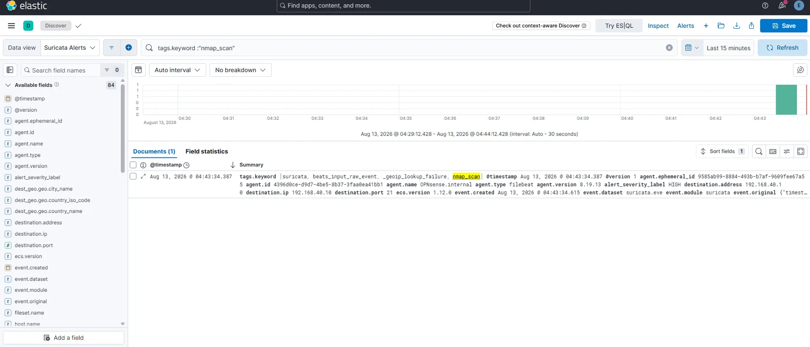
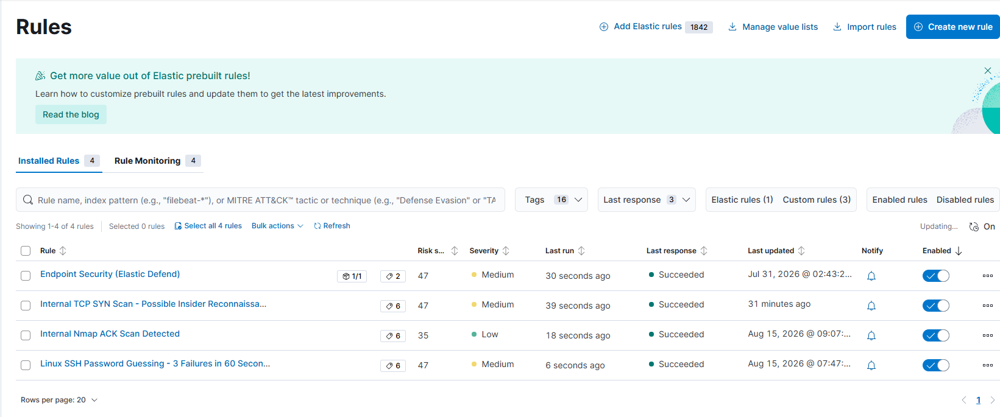

# Detection Engineering & Validation

[← Back to main README](../README.MD) · [Documentation index](README.md)

The lab is used as a closed-loop detection environment rather than a passive dashboard project.

```text
Generate known activity -> Observe network/endpoint telemetry -> Query in Elastic
-> Confirm detection -> Investigate/tune noise -> Repeat
```

## Current Validated Detections

| Detection | Data Source | Elastic Logic | ATT&CK |
|---|---|---|---|
| Nmap ACK scan from the red-team segment | Suricata via Logstash | KQL rule against ECS-normalized Suricata alert indices | `T1046` Network Service Discovery |
| Internal TCP SYN scan / possible insider reconnaissance | Custom Suricata SID `9000001` via Logstash | Query rule matching the custom internal-scan signature | `T1046` Network Service Discovery |
| Linux SSH password guessing | Elastic Agent system/auth | EQL sequence: three failed password logins from same source/host within 60 seconds | `T1110.001` Password Guessing |

## Nmap ACK-Scan Validation

Controlled Nmap activity from Kali validates the full network-detection path.

```text
Kali 192.168.70.10
    -> Nmap ACK scan
    -> Suricata ET SCAN NMAP -sA (1), SID 2000538
    -> Logstash ECS normalization
    -> suricata-alerts-ecs-*
    -> Elastic Security detection
```

A representative validation command is:

```bash
sudo nmap -sA -Pn 192.168.40.10
```

The Security rule is scoped to RFC1918 source and destination traffic:

```kql
suricata.eve.alert.signature : "ET SCAN NMAP -sA (1)" AND
source.ip : "192.168.0.0/16" AND
destination.ip : "192.168.0.0/16"
```

This became practical after `source.ip` and `destination.ip` were migrated to native ECS `ip` mappings in the dedicated `suricata-alerts-ecs-*` path.



## Nmap False-Positive Tuning

The legacy `ET SCAN NMAP -sA (1)` signature generated a large number of events that were not actual internal ACK scans. Investigation showed many hits with:

- public HTTPS servers as the source,
- source port `443`,
- internal clients as destinations,
- high ephemeral destination ports.

That traffic pattern was consistent with **return HTTPS traffic being misclassified**, not an internal Nmap scan.

Rather than suppressing the signature entirely, the Elastic Security rule was narrowed to internal source and destination CIDR ranges. This preserves useful red-team scan coverage while preventing unrelated Internet return traffic from being promoted into Security alerts.

The tuning process is important because it demonstrates that a signature hit is treated as an investigation starting point, not automatically as a true positive.

## Internal Reconnaissance / Insider-Threat Detection

The lab also includes a custom Suricata rule for reconnaissance performed **from one `HOME_NET` system toward another `HOME_NET` system**. This closes the visibility gap left by signatures written only for `$EXTERNAL_NET -> $HOME_NET` traffic and models a compromised workstation or malicious internal user scanning laterally across trusted networks.

The active local rule is:

```text
alert tcp $HOME_NET any -> $HOME_NET any (msg:"HOMELAB Internal TCP SYN Scan - Possible Insider Recon"; flow:stateless; flags:S,CE; dsize:0; threshold:type both, track by_src, count 40, seconds 10; classtype:attempted-recon; sid:9000001; rev:10;)
```

The rule looks for concentrated zero-payload SYN probes from the same internal source and generates a Suricata alert after the configured threshold is reached. Elastic Security then promotes the custom signature into a detection using the stable Suricata SID:

```kql
suricata.eve.alert.signature_id : 9000001
```

A normal TCP SYN scan from an internal lab host can be used to validate the path:

```text
HOME_NET host
    -> TCP SYN scan
    -> custom Suricata SID 9000001
    -> suricata-alerts-ecs-*
    -> Elastic Security
    -> Internal TCP SYN Scan - Possible Insider Reconnaissance
```

The alert is treated as a **possible insider/compromised-host reconnaissance signal**, not proof of malicious intent. Legitimate administrative or vulnerability-scanning activity can resemble this behavior, so the threshold and source context are part of the tuning process.

## Linux SSH Password-Guessing Detection

Linux authentication logs are collected through Elastic Agent and evaluated by an Elastic Security EQL correlation rule.

Structured events include fields such as:

```text
event.action            = ssh_login
event.outcome           = failure
system.auth.ssh.method  = password
system.auth.ssh.event   = Failed
```

The rule detects three password-based SSH failures from the same source to the same host within 60 seconds:

```eql
sequence by source.ip, host.name with maxspan=60s
  [any where event.action == "ssh_login" and event.outcome == "failure" and system.auth.ssh.method == "password"]
  [any where event.action == "ssh_login" and event.outcome == "failure" and system.auth.ssh.method == "password"]
  [any where event.action == "ssh_login" and event.outcome == "failure" and system.auth.ssh.method == "password"]
```

The rule operates against `logs-system.auth-*` and is mapped to **Credential Access → T1110 → T1110.001 Password Guessing**.

## Elastic Security Rule Validation

The current Elastic Security rule set includes the validated Nmap ACK-scan, internal TCP SYN reconnaissance, SSH password-guessing, and Endpoint Security detections.



The rules are exercised with controlled lab activity and only considered complete after the source telemetry, query logic, and resulting Security alert are confirmed end-to-end.

## Detection Data Engineering

The Suricata detection path uses a dedicated ECS template rather than relying on historical dynamic mappings. Core fields include:

```text
@timestamp        -> date
source.ip         -> ip
destination.ip    -> ip
source.port       -> long
destination.port  -> long
event.kind        -> keyword
event.category    -> keyword
event.type        -> keyword
```

This separates current detection data from older indices with incompatible mappings and allows native CIDR logic in Security rules.

Configuration references:

- [Sanitized Logstash pipeline](../configs/sanitized/logstash-opnsense.conf)
- [Suricata ECS template](../configs/sanitized/suricata-alerts-ecs-template.json)
- [Custom Suricata local rules](../configs/sanitized/suricata-local.rules)

## Validation Philosophy

A detection is not considered complete simply because a rule exists. The preferred workflow is:

1. Define the behavior to detect.
2. Generate known activity in the isolated lab.
3. Verify the source telemetry arrived.
4. Confirm fields/mappings support the intended query.
5. Trigger the Security rule.
6. Inspect false positives and traffic context.
7. Tune scope without destroying useful coverage.
8. Re-run the validation.

This creates evidence that the control works from **activity generation through alerting**, rather than presenting only a configured rule or dashboard screenshot.
