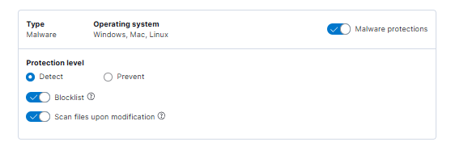
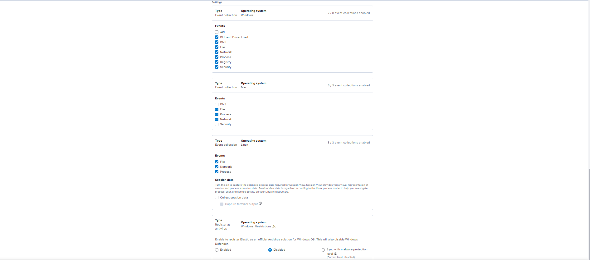
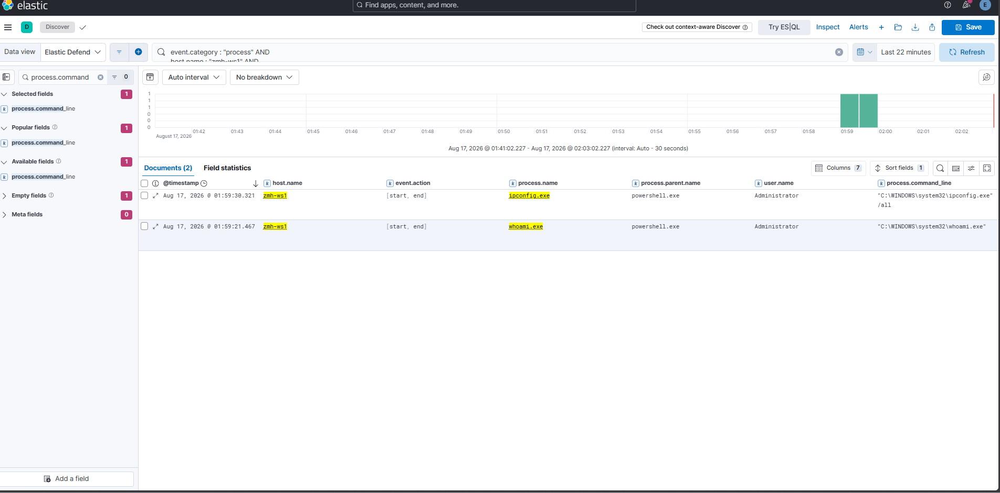
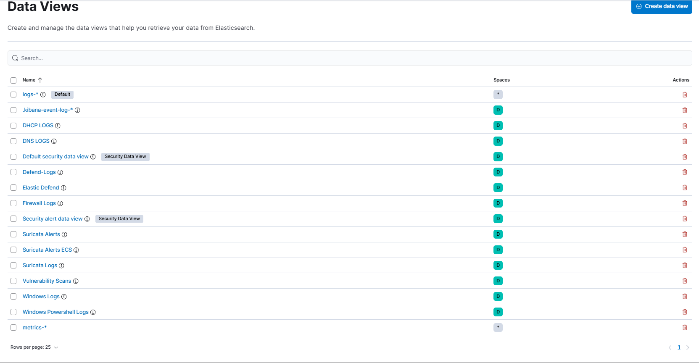

# Elastic SIEM & Endpoint Telemetry

[← Back to main README](../README.MD) · [Documentation index](README.md)

The Elastic deployment combines network telemetry from OPNsense with Windows/Linux endpoint telemetry, Elastic Defend, Sysmon, and Elastic Security detections. The goal is to make one controlled action traceable across firewall, IDS, host, authentication, and alert data.

## Pipeline

```text
OPNsense (Filebeat)
    |
    | TLS :5044
    v
Logstash
    |-- Suricata alerts  --> suricata-alerts-ecs-*
    |-- Suricata logs    --> suricata-logs-*
    |-- Firewall logs    --> firewall-logs-*
    |-- DNS logs         --> dns-logs-*
    |-- DHCP logs        --> dhcp-logs-*
    |-- OPNsense auth    --> opnsense-auth-*
    |
    | verified TLS / internal CA
    v
Elasticsearch
    |
    v
Kibana / Elastic Security

Elastic Agent / Fleet
    |-- Elastic Defend endpoint telemetry
    |-- Windows Security/System/Application logs
    |-- Sysmon telemetry
    |-- Linux system/auth logs
    v
Elasticsearch
```

## Verified TLS

The telemetry pipeline is not configured with certificate verification disabled.

- OPNsense Filebeat validates the Logstash server certificate.
- Logstash connects to Elasticsearch over HTTPS.
- Logstash validates the internal CA chain and performs full server identity verification.
- Elasticsearch presents the HTTP leaf certificate together with the issuing intermediate so clients can build the expected chain.
- Kibana and Fleet trust the internal PKI rather than bypassing certificate validation.

Sanitized examples are published in:

- [Filebeat configuration](../configs/sanitized/filebeat-opnsense.yml)
- [Logstash pipeline](../configs/sanitized/logstash-opnsense.conf)
- [Elasticsearch configuration](../configs/sanitized/elasticsearch.yml)
- [Kibana configuration](../configs/sanitized/kibana.yml)

## Fleet

Fleet centrally manages Elastic Agents used by lab systems.


Central management keeps integrations and endpoint collection consistent instead of treating each host as a one-off installation.

## Elastic Defend & Sysmon

Windows endpoint visibility deliberately uses **multiple telemetry sources**.

Elastic Agent carries the Elastic Defend integration for endpoint-security telemetry, while Sysmon adds detailed Windows process and host events that are useful for investigation and detection engineering. Windows Security/System/Application logs provide additional authentication and operating-system context.

### Elastic Defend Policy

Elastic Defend is centrally applied through Fleet to the scoped Windows systems. The current policy uses Elastic for malware detection and endpoint telemetry while Microsoft Defender remains the primary Windows antivirus, providing layered visibility without replacing the native Windows prevention layer.





The policy captures the process, file, and network telemetry used for investigations and detection development. Central policy management also makes changes auditable and avoids host-by-host configuration drift.

### Elastic Defend Process Telemetry

Elastic Defend process events are searchable in Kibana using the dedicated Endpoint data view. A controlled test on the Windows workstation validated visibility into common administrative processes and exposed useful fields such as host, process, parent process, user, action, and command line.



A representative query used during validation is:

```kql
event.category : "process" AND
host.name : "zmh-ws1" AND
process.name : ("notepad.exe" OR "whoami.exe" OR "ipconfig.exe")
```

This creates a repeatable endpoint-validation workflow before behavior is promoted into a detection rule.

### Elastic Defend Alert Validation

The Endpoint protection path was also validated with the standard EICAR antivirus test file in the lab. Microsoft Defender intercepted the first test before Elastic could alert, so a temporary Defender exclusion was created for a dedicated EICAR test folder. Elastic Defend then generated its first Endpoint alert, creating the `logs-endpoint.alerts-*` data stream and confirming the prebuilt **Endpoint Security (Elastic Defend)** rule could promote Endpoint detections into Elastic Security.

The temporary Defender exclusion was removed immediately after validation.

### Group Policy Deployment

Separate Active Directory Group Policy Objects deploy:

- **Elastic Agent / Elastic Defend** to scoped Windows systems.
- **Sysmon** to scoped Windows systems.

This turns Active Directory into part of the security-management plane. Endpoint instrumentation is repeatable and centrally controlled rather than manually installed on each VM, reducing configuration drift and making future domain systems easier to onboard consistently.

For the AD side of this workflow, see [Active Directory & GPO Deployment](active-directory.md).

## Data Views

Kibana data views keep different telemetry families easy to query while preserving index separation. A dedicated Suricata ECS data view targets `suricata-alerts-ecs-*` so current detection data does not mix with historical Suricata indices that used incompatible dynamic mappings. A separate **Elastic Defend** data view targets `logs-endpoint.*`, making process, file, network, and Endpoint alert telemetry easy to investigate from one Discover view.



*Current Kibana data views, including the dedicated Suricata ECS and Elastic Defend views used for detection and endpoint investigation.*

## Suricata ECS Normalization

Historical custom Suricata indices mapped `source.ip` and `destination.ip` as text/keyword fields, preventing reliable native CIDR matching in Elastic Security.

The current alert path uses an ECS-compatible template:

```text
source.ip        -> ip
destination.ip   -> ip
source.port      -> long
destination.port -> long
```

Logstash also adds security-event context:

```text
event.kind     = alert
event.category = intrusion_detection
event.type     = allowed
```

The dedicated template is published at [suricata-alerts-ecs-template.json](../configs/sanitized/suricata-alerts-ecs-template.json).

## Security Overview Dashboard

A custom Kibana dashboard summarizes high-value signals such as Suricata alerts, internal firewall blocks, Windows failed logons, alert trends, blocked destination ports, and top Suricata signatures.


The dashboard is designed to answer three quick questions:

- **What is being blocked?**
- **What is Suricata detecting?**
- **Are endpoint authentication events showing suspicious activity?**

## Windows Failed Logons

Windows Security Event ID `4625` is collected from the domain workstation and can be queried directly in Kibana.


This independently validates the endpoint side of the telemetry pipeline rather than relying only on network IDS evidence.

## Runtime Field for Blocked Destination Ports

The custom OPNsense `filterlog` path preserved destination-port data inside the raw `rest` field rather than immediately mapping it into a dedicated ECS destination-port field. A Kibana runtime field was created to extract TCP/UDP destination ports so the dashboard could visualize commonly blocked services without waiting for a larger parser migration.

That visibility helped identify:

- unexpected SMTP/25 attempts from a Proxmox host,
- legitimate NTS key-establishment traffic on TCP/4460 from Vault,
- blocked red-team testing traffic,
- expected NetBIOS and DNS chatter crossing restricted boundaries.

## Why the Pipeline Matters

The Elastic environment is used as an engineering loop, not only as a dashboard:

```text
Generate activity -> Observe telemetry -> Validate parsing/mappings
-> Create or tune detection -> Confirm Security alert -> Investigate noise
```

That workflow is documented in more detail in [Detection Engineering & Validation](detection-engineering.md).
